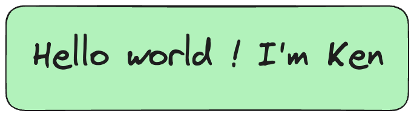

## About me 🌱
Hello！Welcome to my profile, I'm a full stack engineer. 
I'm working in NetEase on last couple of years. 

My job include：
1. automated testing, 
2. client tool, 
3. web [backend、 frontend],
4. unreal game development,
5. etc...

## Skill
  

<!--
**tsqqqqqq/tsqqqqqq** is a ✨ _special_ ✨ repository because its `README.md` (this file) appears on your GitHub profile.

Here are some ideas to get you started:

- 🔭 I’m currently working on ...
- 🌱 I’m currently learning ...
- 👯 I’m looking to collaborate on ...
- 🤔 I’m looking for help with ...
- 💬 Ask me about ...
- 📫 How to reach me: ...
- 😄 Pronouns: ...
- ⚡ Fun fact: ...
-->
